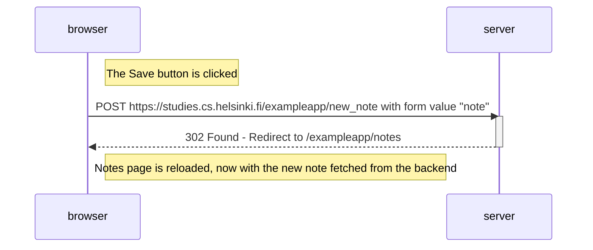

```mermaid
sequenceDiagram
    participant browser
    participant server

    Note right of browser: The Save button is clicked

    browser->>server: POST https://studies.cs.helsinki.fi/exampleapp/new_note with form value "note"
    activate server
    server-->>browser: 302 Found - Redirect to /exampleapp/notes
    deactivate server

    Note right of browser: Notes page is reloaded, now with the new note fetched from the backend
```