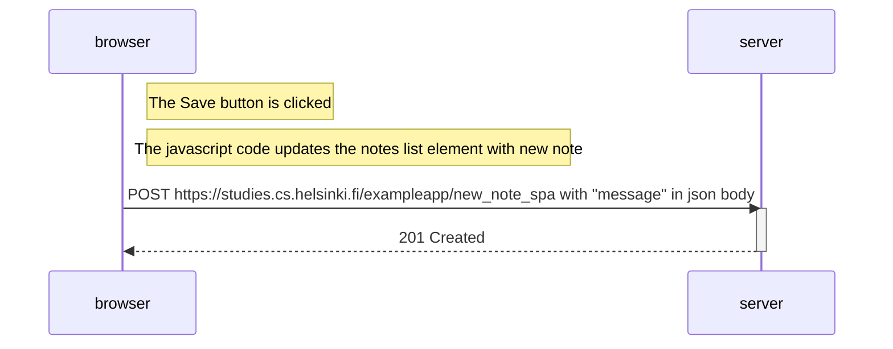

```mermaid
sequenceDiagram
    participant browser
    participant server

    Note right of browser: The Save button is clicked
    
    Note right of browser: The javascript code updates the notes list element with new note

    browser->>server: POST https://studies.cs.helsinki.fi/exampleapp/new_note_spa with "message" in json body
    activate server
    server-->>browser: 201 Created
    deactivate server
```